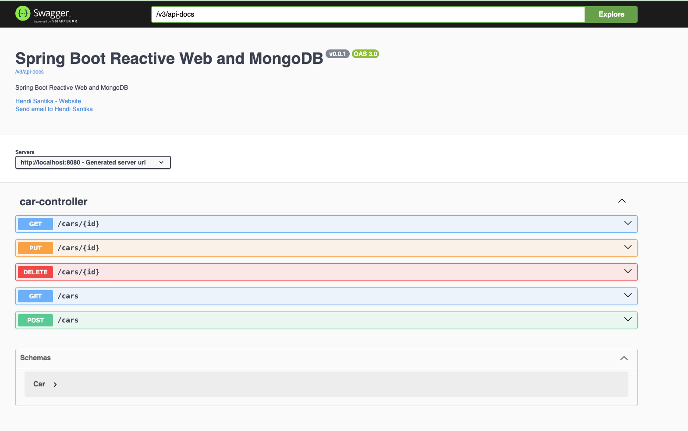

# Spring-Boot-Reactive-Web-MongoDB

### Things todo list:

1. Clone this repository: `git clone https://github.com/hendisantika/Spring-Boot-Reactive-Web-MongoDB.git`
2. Navigate to the folder: `cd Spring-Boot-Reactive-Web-MongoDB`
3. Run the application: `gradle clean bootRun`
4. Open your favorite browser: http://localhost:8080/swagger-ui

Swagger UI

